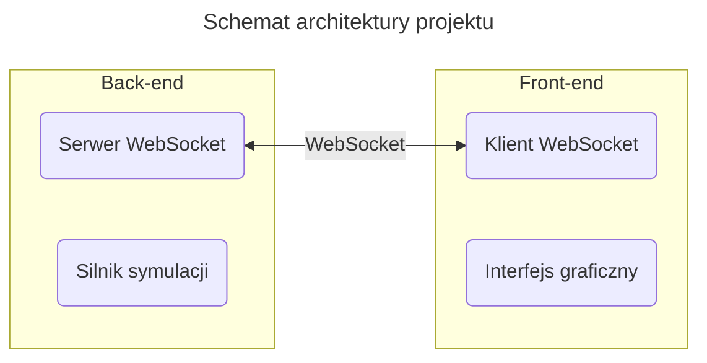
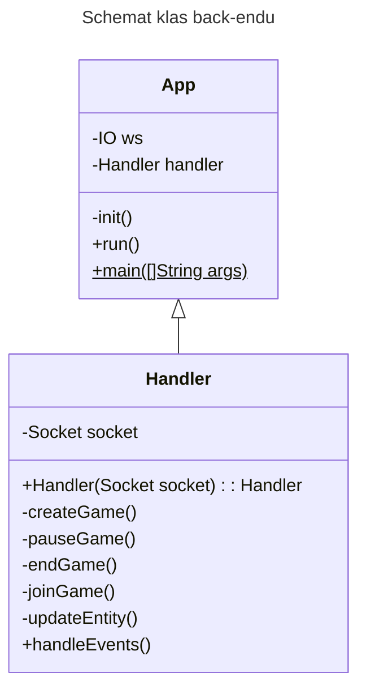
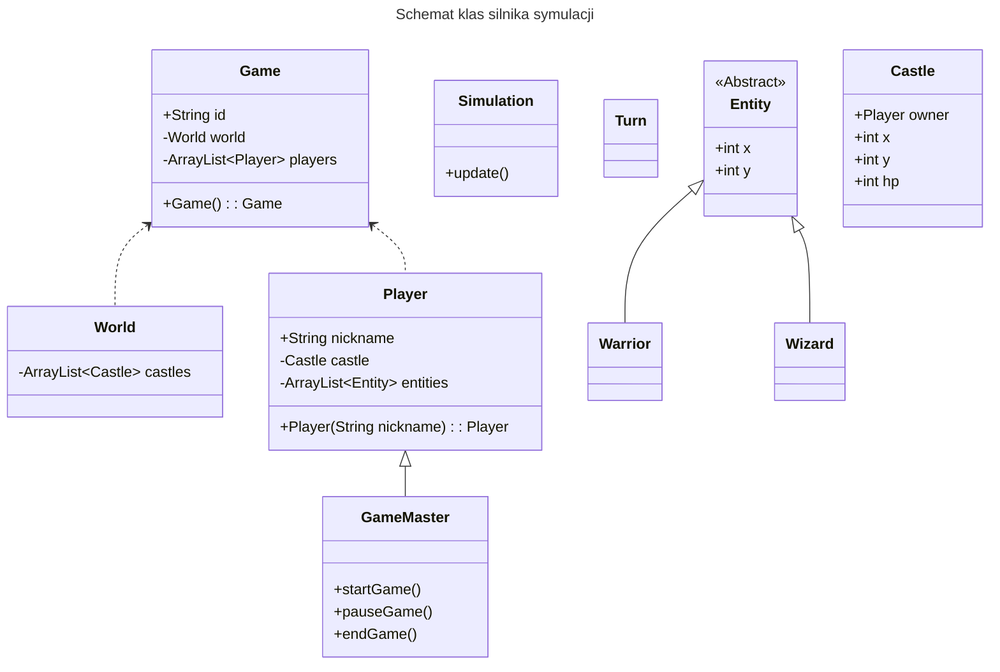

# Dokumentacja

## Architektura

Projekt został podzielony na dwie części:

- **back-end** – część odpowiadającą za logikę gry, przeprowadzenie symulacji oraz komunikację z klientami gry.
- **front-end** – warstwę interaktywną projektu, która udostępnia graficzny interfejs do manipulacji obiektami oraz przedstawia wizualną reprezentację symulacji.

### Backend

### Silnik symulacji

Klasy w silniku symulacji:

- **Game** – instancje tej klasy reprezentują każdą utworzoną przez użytkowników grę
- **World** – klasa przechowująca obecny stan planszy

